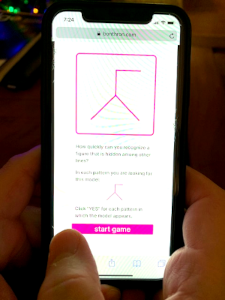

# FlexibilityOfClosure
HTML5 puzzle for mobile and desktop: Find a hidden pattern in geometrical configuration.

*Flexibility of Closure* is the cognitive ability to hold a given visual percept or configuration in mind so as to disembed it from other well defined perceptural material.

This was coded using a functional reactive style. It uses Bacon JS, a functional reactive programming library for JavaScript. 

